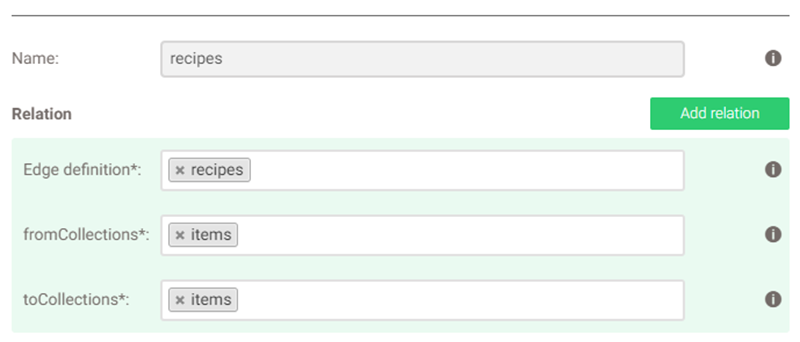
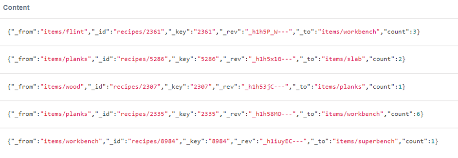

# Построение: 
Помимо создания коллекции items и коллекции рёбер recipes необходимо также создать граф с тем же названием recipes:


Пример графа:


# 1. Поиск подходящих предметов
## Запрос
```aql
LET startingNodes = @items

LET nodesResults = (
  FOR snode in startingNodes
  RETURN (
    FOR v, e, p in 1
    OUTBOUND snode.item
    GRAPH recipes
    OPTIONS {uniqueVertices: 'path'}
    RETURN {id: v._id, count: e.count, ingredient: snode.item}
  )
)

LET nodeIdResults = UNIQUE(
      (FOR arr in nodesResults
       RETURN (FOR v in arr RETURN v.id) 
       )[**]
    )

LET out = (
  FOR result in nodeIdResults
  LET ingredients = (
    FOR v, e, p in 1
    INBOUND result
    GRAPH recipes
    RETURN {item: v._id, count: e.count}
  )
  
  FILTER (FOR i in ingredients
        RETURN startingNodes[? ANY FILTER CURRENT.item == i.item AND CURRENT.count >= i.count]
    )[*] ALL == true
  
  return {result: result, ingredients: ingredients}
)

return out
```

## Пример параметров
```json
{
    "items": [
        {
            "item": "items/planks",
            "count": 7
        },
        {
            "item": "items/flint",
            "count": 5
        }
    ]
}
```

## Пример вывода
```json
[
  [
    {
      "result": "items/workbench",
      "ingredients": [
        {
          "item": "items/planks",
          "count": 6
        },
        {
          "item": "items/flint",
          "count": 3
        }
      ]
    },
    {
      "result": "items/slab",
      "ingredients": [
        {
          "item": "items/planks",
          "count": 2
        }
      ]
    }
  ]
]
```

# 2. Получение всех рецептов, содержащий указанный ингредиент
## Запрос
```aql 
LET startingNode = @item

FOR v, e, p in 1
    OUTBOUND startingNode
    GRAPH recipes
    OPTIONS {uniqueVertices: 'path'}
    RETURN {result: v._id, ingredient_count: e.count}
```

## Пример параметров
```json
{
  "item": "items/planks"
}
```

## Пример вывода
```json
[
  {
    "result": "items/workbench",
    "ingredient_count": 6
  },
  {
    "result": "items/slab",
    "ingredient_count": 2
  }
]
```

# 3. Получение всех ингредиентов, требуемых для создания конкретного предмета
## Запрос
```aql 
LET startingNode = @item

FOR v, e, p in 1
    INBOUND startingNode
    GRAPH recipes
    OPTIONS {uniqueVertices: 'path'}
    RETURN {result: v._id, ingredient_count: e.count}
```

## Пример параметров
```json
{
  "item": "items/planks"
}
```

## Пример вывода
```json
[
  {
    "result": "items/wood",
    "ingredient_count": 1
  }
]
```